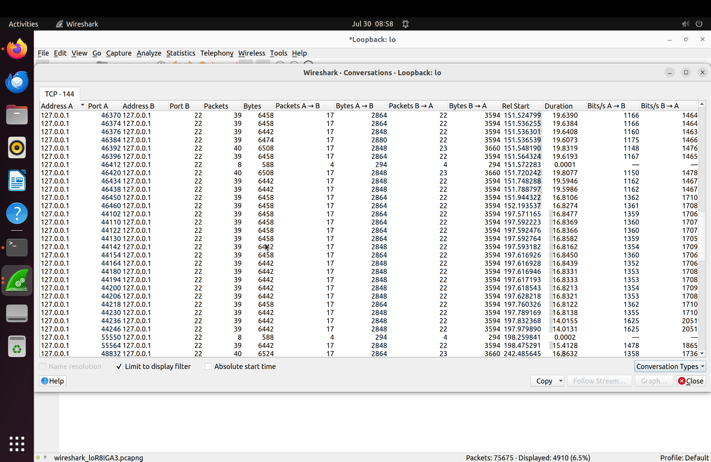
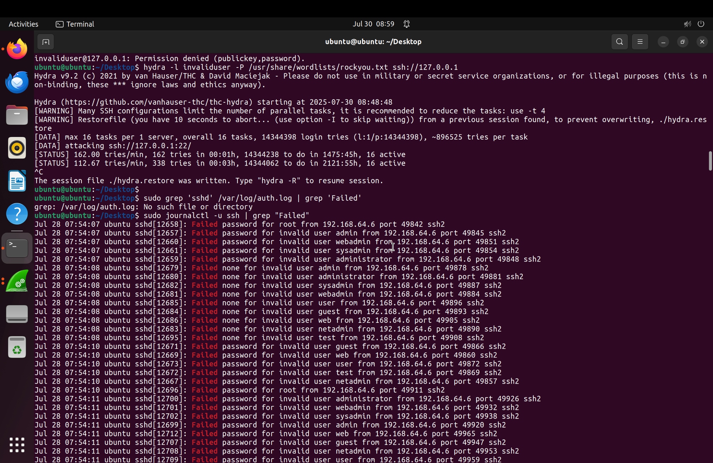
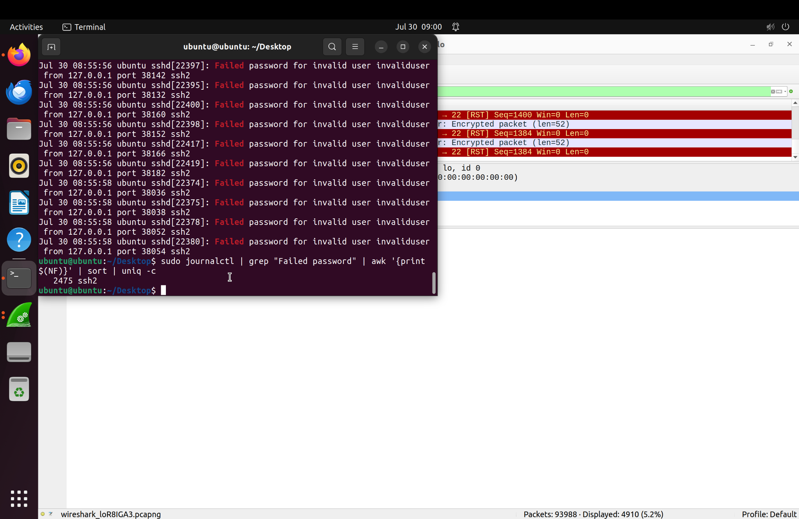
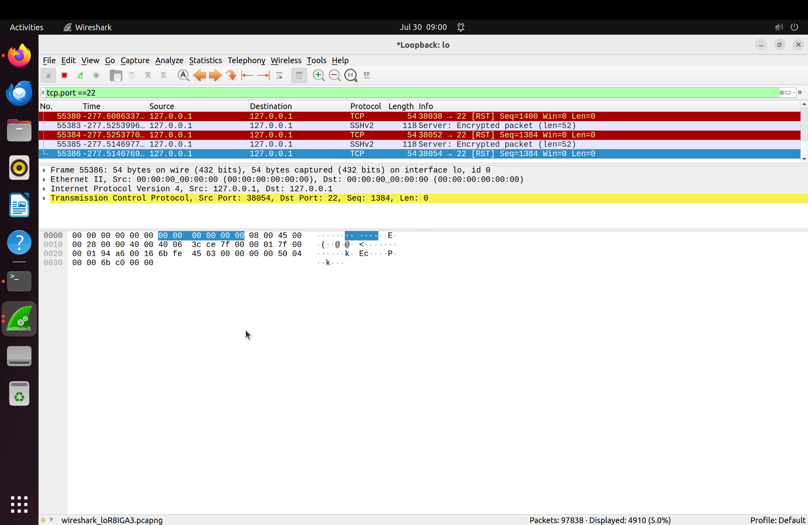
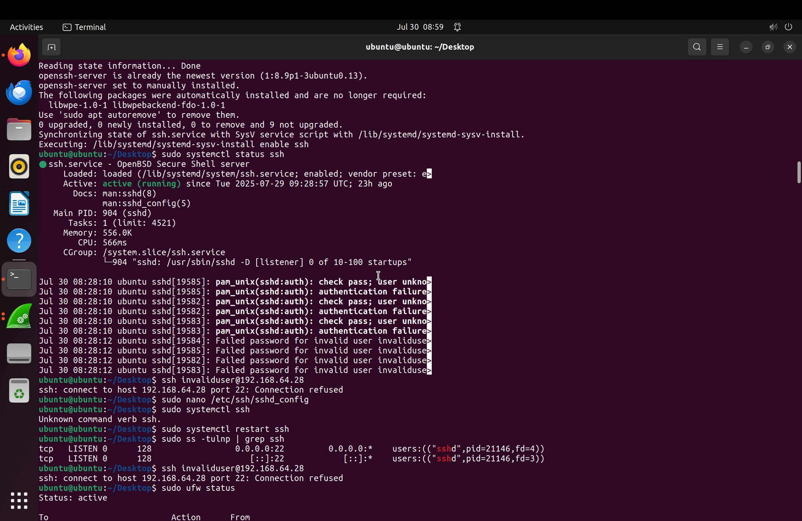

# SSH Brute-Force Detection - SOC Home Lab Report

**Analyst:** Kishor Pudasaini  
**Date:** July 30, 2025

---

## Summary

This project simulates a brute-force SSH attack using Hydra on the localhost (127.0.0.1), monitored and investigated using tools like journalctl, awk, grep, and Wireshark in a SOC home lab environment. The goal is to replicate a real-world scenario to enhance practical detection and investigation skills required in a SOC Analyst role.

---

## Attack Simulation with Hydra

Hydra was used to launch a brute-force SSH attack with a common password list:



---

## Log-Based Detection

Failed login attempts were traced using `journalctl` and filtered via `grep` and `awk`:

```bash
sudo journalctl -u ssh | grep "Failed password"
sudo journalctl | grep "Failed password" | awk '{print $(NF)}' | sort | uniq -c
```

- Total failed attempts: **2475**

  


---

## Network Analysis Using Wireshark

Port 22 traffic was filtered and analyzed for TCP connection spikes and RST flags indicating dropped sessions.

### TCP Connections on Port 22:


### RST Flags and SSH Packets:


---

## Skills Practiced

- Linux command-line filtering and monitoring
- SSH brute-force simulation with Hydra
- Log parsing using journalctl, grep, awk
- Network forensics with Wireshark
- SOC report writing and documentation

---

## Disclaimer

This is a safe lab-based simulation conducted on localhost. No external systems or networks were targeted.
